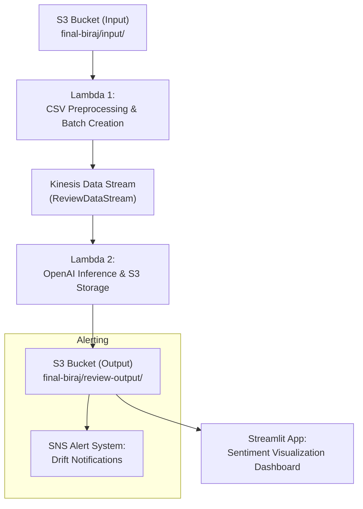

# Real-time Amazon Review Product Summarizer

## Overview
This project implements a real-time product review summarization system for Amazon products. It combines data engineering, machine learning, and MLOps principles to process, analyze, and visualize customer sentiment from large volumes of unstructured text data.

The system provides timely and structured insights from user-generated feedback, making it valuable for:
- Product teams
- Marketing departments
- E-commerce analysts

By leveraging AWS infrastructure and OpenAI's GPT-3.5, the project delivers an efficient, automated system that bridges data engineering with natural language processing.

## Architecture

### Data Engineering Pipeline
1. **Data Ingestion**
   - CSV files containing Amazon reviews are uploaded to S3 bucket
   - Files are named using product ASIN (e.g., B00LGEKOMS.csv)
   - AWS Lambda function triggers on file upload

2. **Data Processing**
   - Lambda performs data cleaning and timestamp validation
   - Reviews are processed in batches of 500
   - Titles and texts are concatenated for summarization
   - Metadata includes ASIN, batch number, and timestamp range
   - Processed batches sent to AWS Kinesis Data Stream

3. **Key Components**
   - AWS S3 for storage
   - AWS Lambda for serverless processing
   - AWS Kinesis Data Stream for real-time delivery
   - Pandas for preprocessing

### Machine Learning Model

The system uses OpenAI's GPT-3.5 model for abstractive summarization:
- Each batch of 500 reviews is processed
- Model generates structured summaries including:
  - Overall sentiment
  - Good points
  - Bad points
  - Sentiment score (1-10 Likert scale)
- Results stored as JSON objects with metadata

### MLOps Implementation

1. **Processing Pipeline**
   - Lambda function triggered by Kinesis stream records
   - OpenAI API processes review batches
   - Results stored in output S3 bucket

2. **Visualization**
   - Streamlit web application for results display
   - Interactive dashboard showing:
     - Available ASINs
     - Processed batches
     - Time-series sentiment graphs
     - Detailed summaries

## Performance Analysis

### Processing Metrics
- Large CSV processing: < 1 minute
- Typical product (6000 reviews): 12 batches
- Batch processing time: 1.5-2 seconds

### Cost Estimation (per 100 batches)
- AWS Lambda: ~$0.20
- AWS Kinesis: ~$0.015/hour/shard
- AWS S3: Negligible
- OpenAI API: ~$0.02/batch
- Total estimated cost: ~$2.25

## Future Work

1. **Monitoring & Alerts**
   - Implement drift detection
   - AWS SNS integration for alerts
   - DynamoDB/Redshift integration

2. **Infrastructure**
   - CI/CD pipelines (AWS CodePipeline/GitHub Actions)
   - Infrastructure as code (AWS SAM/Terraform)

## References

- [Amazon Review Dataset](https://nijianmo.github.io/amazon/index.html)
- [Review Dataset 2023](https://amazon-reviews-2023.github.io/)
- [AWS Documentation](https://docs.aws.amazon.com/)
- [LLaMA Model](https://github.com/facebookresearch/llama)
- [OpenAI API](https://platform.openai.com/docs/)
- ROUGE Metrics: Lin, C. Y. (2004). "ROUGE: A Package for Automatic Evaluation of Summaries."

## System Flow Diagram



## Lambda Functions

### Preprocessing Lambda

```python
// ... existing code ...
```

### Inference Lambda

```python
// ... existing code ...
```

### Streamlit Dashboard

```python
// ... existing code ...
```


